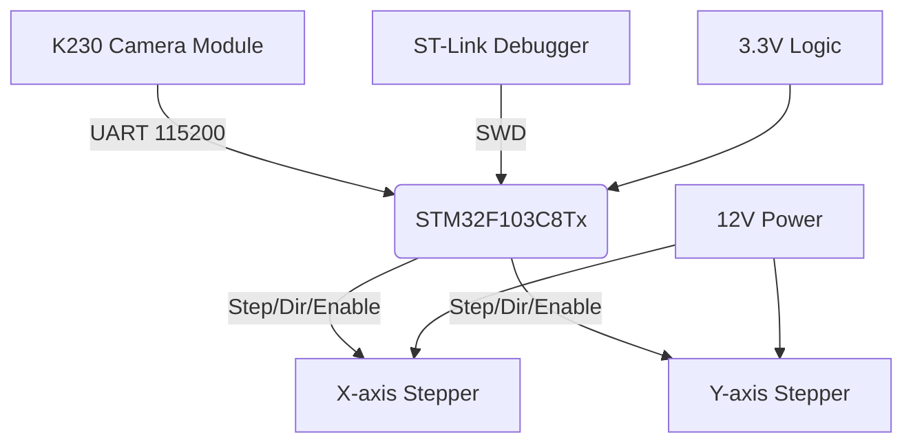

# STM32F103 CTRL Project

 <!-- Optional: Add banner image -->

## 🚀 Live Demo & Documentation

- **GitHub Repository**: [github.com/qiogn/CTRL](https://github.com/qiogn/CTRL)
- **Latest Release**: [v1.0.0](https://github.com/qiogn/CTRL/releases/latest)
- **Build Status**: 

## 📋 Project Overview

This is an STM32F103C8Tx-based control system that coordinates dual stepper motors with real-time vision feedback from a K230 camera module. The system processes coordinate data via UART and adjusts motor positions accordingly, creating a closed-loop control system.

### Key Features
- ✅ **Dual-axis stepper motor control**
- ✅ **K230 vision module integration**
- ✅ **CMake & Keil MDK build systems**
- ✅ **OpenOCD flashing support**
- ✅ **VS Code development environment**

## 🔧 Hardware Architecture



## 📊 Build Status

| Component | Status | Details |
|-----------|--------|---------|
| **CMake Build** |  | Debug & Release configurations |
| **Static Analysis** |  | cppcheck validation |
| **Documentation** |  | README & API docs |

## 📁 Project Structure

```
CTRL/
├── Core/              # Application source code
├── Drivers/           # STM32 HAL libraries  
├── MDK-ARM/           # Keil uVision project
├── scripts/           # Build & flash utilities
├── docs/              # Documentation (this site)
└── .github/           # CI/CD workflows
```

## 🛠️ Quick Start

### Prerequisites
- ARM GCC toolchain (`arm-none-eabi-gcc`)
- CMake 3.22+
- ST-Link debugger
- K230 vision module

### Build Instructions
```bash
# Clone repository
git clone https://github.com/qiogn/CTRL.git
cd CTRL

# Configure with CMake
cmake -S . -B build -DCMAKE_BUILD_TYPE=Debug

# Build
cmake --build build

# Flash to device (using OpenOCD)
./scripts/openocd_flash.ps1
```

## 📈 Performance Metrics

| Metric | Value | Notes |
|--------|-------|-------|
| **Step Rate** | 1000 steps/sec | Per motor maximum |
| **Vision Update** | 100 Hz | Coordinate processing rate |
| **Resolution** | 640×360 | Coordinate system |
| **Deadzone** | 6×6 pixels | Center region immunity |

## 🔗 Communication Protocol

The system uses a custom UART protocol for vision data:

```
Frame Format: AA FF F2 04 xL xH yL yH SC AC
```
- **Header**: `AA FF`
- **Function**: `F2` (coordinate data)
- **Length**: `04` (4 bytes of data)
- **Data**: X and Y coordinates (16-bit each, little-endian)
- **Checksum**: SC and AC bytes

## 🧪 Testing & Validation

The project includes automated testing through GitHub Actions:

1. **CMake Build Validation** - Compiles for Debug and Release configurations
2. **Static Code Analysis** - Runs cppcheck for code quality
3. **Documentation Check** - Ensures README and docs are present
4. **Binary Size Verification** - Monitors firmware size growth

## 📄 License

This project is licensed under the MIT License - see the [LICENSE](../LICENSE) file for details.

## 🤝 Contributing

We welcome contributions! Please see our [Contributing Guidelines](../CONTRIBUTING.md) for details.

1. Fork the repository
2. Create a feature branch
3. Make your changes
4. Submit a pull request

## 📞 Support

- **Issues**: [GitHub Issues](https://github.com/qiogn/CTRL/issues)
- **Discussions**: [GitHub Discussions](https://github.com/qiogn/CTRL/discussions)
- **Email**: Open an issue for direct contact

---

*Last Updated: {{ site.time | date: "%Y-%m-%d" }}*